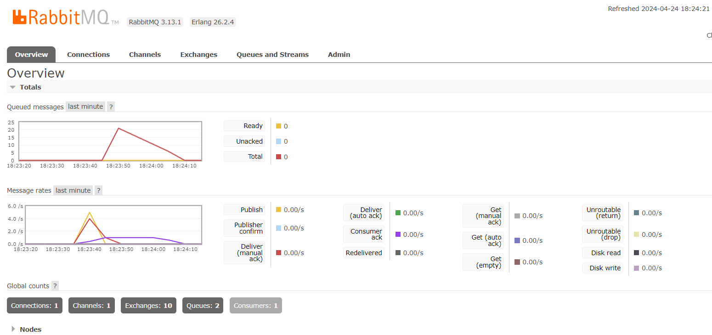

# Module 8 - Subscriber
## Reflection
### a. What is amqp?
> AMQP (Advanced Message Queuing Protocol) adalah protokol open-source untuk komunikasi antara aplikasi atau program 
> komputer. AMQP mendefinisikan aturan untuk mengirim data antar proses yang berjalan pada mesin yang berbeda. 
> Protokol ini memungkinkan aplikasi untuk mengirim dan menerima pesan secara asinkron. 
>
> Tujuan utama dari AMQP adalah untuk memastikan pengiriman pesan yang handal dan interoperabilitas nya tinggi 
> di antara aplikasi yang berjalan di berbagai sistem operasi, bahasa pemrograman, dan hardware yang berbeda.

### b. what it means? `guest:guest@localhost:5672`, what is the first quest, and what is the second guest, and what is localhost:5672 is for?

> `guest:guest@localhost:5672` adalah sebuah connection string untuk mengakses server AMQP RabbitMQ. Connection string ini mengikuti format umum: `<username>:<password>@<host>:<port>`.
>
> 1. `guest` (yang pertama) adalah username untuk autentikasi ke server RabbitMQ. `guest` adalah username bawaan untuk RabbitMQ.
>
>2. `guest` (yang kedua) adalah password yang sesuai dengan username `guest` untuk autentikasi. `guest` juga merupakan password bawaan RabbitMQ.
>
>3. `localhost` mengacu pada alamat IP 127.0.0.1 yang merupakan alamat loopback untuk mengakses server RabbitMQ yang berjalan pada mesin yang sama. Jika server RabbitMQ berjalan di mesin lain, bagian ini harus diisi dengan nama host atau IP address server tersebut.
>
>4. `5672` adalah nomor port standar yang digunakan oleh RabbitMQ untuk komunikasi AMQP. Port ini digunakan untuk menerima koneksi dari aplikasi klien yang ingin berkomunikasi dengan server RabbitMQ.
>
>Connection string tersebut digunakan oleh aplikasi client untuk mengonfigurasi koneksi ke server RabbitMQ dan memulai komunikasi AMQP seperti mengirim atau menerima pesan dari queue.

### Simulation slow subscriber

> Gambar tersebut menunjukkan bahwa subscriber mengalami keterlambatan dalam memproses data yang diterima dari message broker, yang menyebabkan penundaan dalam setiap proses. Akibatnya, queued messages di message broker akan terus meningkat seiring dengan bertambahnya penundaan, karena publisher mengirimkan pesan lebih cepat dibandingkan konsumer yang menerima pesan. Dalam kasus ini, jumlah maksimum pesan yang mengantre mencapai 21 saat menjalankan aplikasi publisher sebanyak 5 kali menggunakan perintah `cargo run`.